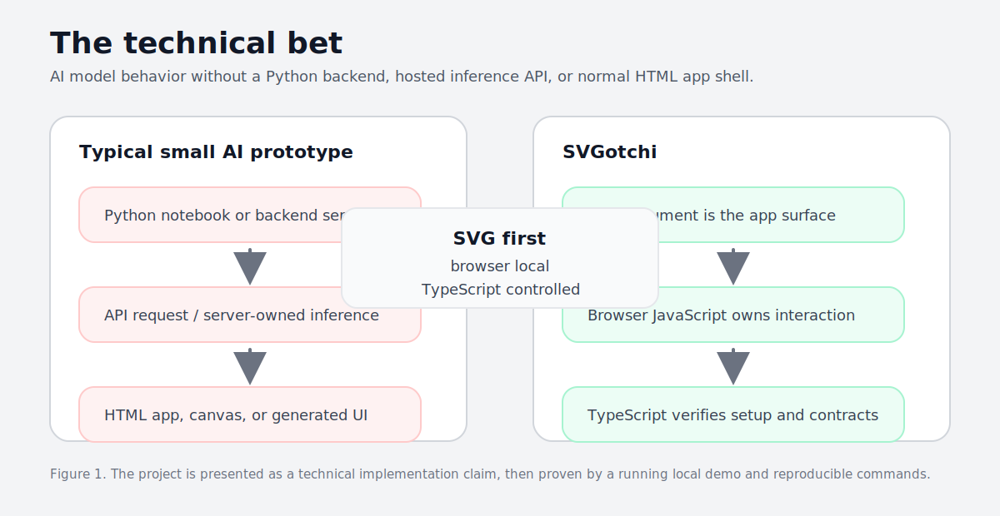
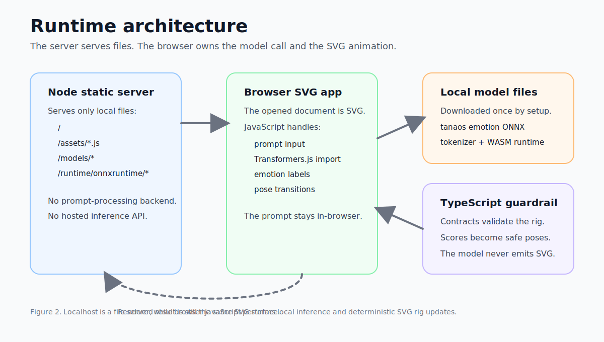
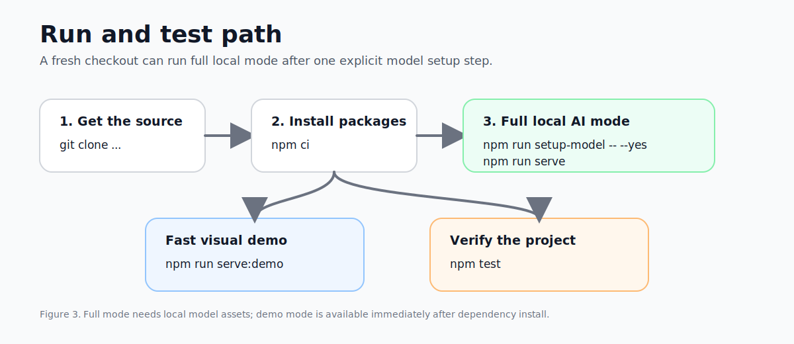

<h1 align="center">SVGotchi</h1>

<p align="center">
  
</p>

<p align="center">
  <strong>A local-first AI companion that lives inside an SVG document.</strong>
</p>

<p align="center">
  SVGotchi is an SVG-first experiment: instead of a Python backend, hosted inference API, or normal HTML app shell, the opened SVG document becomes the product surface. Browser JavaScript handles interaction and local inference; TypeScript keeps the setup, verification, contracts, and transition logic under control.
</p>

<p align="center">
  <a href="https://github.com/Everyseok/svgotchi">
    
  </a>
  
  
  
  
</p>

---

## Figure 1. Running Prototype

<p align="center">
  
</p>

<p align="center">
  The browser opens an SVG document, accepts prompt input, runs local emotion inference, and animates the character rig without a backend prompt-processing service.
</p>

---

## Figure 2. Technical Bet

<p align="center">
  
</p>

---

## Figure 3. Runtime Architecture

<p align="center">
  
</p>

---

## Figure 4. Run and Test Flow

<p align="center">
  
</p>

---

## Run It

Fresh checkout, full local AI mode:

```bash
git clone https://github.com/Everyseok/svgotchi.git
cd svgotchi
npm ci
npm run setup-model -- --yes
npm run serve
```

Open the URL printed by the terminal. The default is:

```text
http://127.0.0.1:4173/?mode=full
```

Fast visual demo without model setup:

```bash
git clone https://github.com/Everyseok/svgotchi.git
cd svgotchi
npm ci
npm run serve:demo
```

Stop the local server with `Ctrl+C`.

---

## Test It

```bash
npm test
npm run verify:model
```

Full release verification after model setup:

```bash
npm run verify:release
```

---

## Requirements

| Requirement | Version / Note |
|---|---|
| Node.js | `>= 24.0.0` |
| Browser | Modern Chromium, Safari, or Firefox |
| Network | Required once for `setup-model` |
| Model payload | About 164 MiB, stored in ignored `models/` and `runtime/` folders |

---

## Troubleshooting

| Symptom | Fix |
|---|---|
| `Full local model mode requires local model assets.` | Run `npm run setup-model -- --yes`, then `npm run serve`. |
| `npm ERR! 404 Not Found - svgotchi` | The npm package is not published yet. Use the GitHub source checkout above. |
| Browser did not open automatically | Open `http://127.0.0.1:4173/?mode=full`, or the port printed by the terminal. |
| `node` crashes before npm runs | Reinstall Node, then check `node -v`. |

---

## Model Boundary

The model returns emotion labels and scores. SVGotchi code maps that evidence into deterministic SVG rig transitions.

The model does not generate reply text, SVG, CSS, JavaScript, DOM selectors, path data, or animation code.

---

## Author

**Jun Seok Kim**<br />
GitHub: [@Everyseok](https://github.com/Everyseok)

---

<p align="center">
  <strong>SVG first. Browser local. TypeScript controlled.</strong>
</p>
