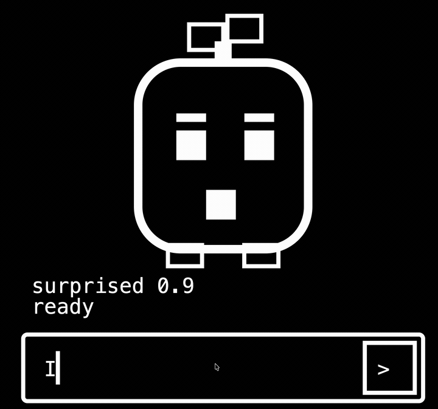
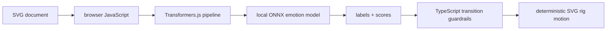
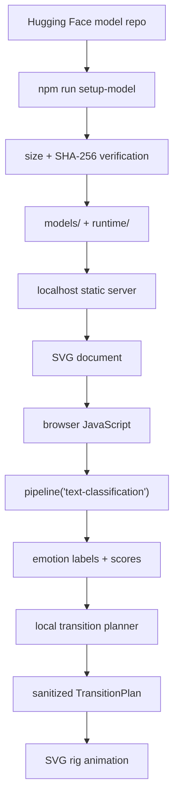

<h1 align="center">SVGotchi</h1>

<p align="center">
  
</p>

<p align="center">
  <strong>An SVG-first local AI companion.</strong><br />
  No Python backend. No hosted inference API. No normal HTML app shell.
</p>

<p align="center">
  <a href="https://github.com/Everyseok/svgotchi">
    
  </a>
  
  
  
  
</p>

---

## Demo

<p align="center">
  
</p>

---

## What Makes It Different

| Usual small AI app | SVGotchi |
|---|---|
| Python backend or notebook starts the model loop | The opened SVG document is the app surface |
| Prompt goes to a server/API | Prompt stays in the browser |
| Backend owns inference | Transformers.js loads a local ONNX model in the browser |
| UI state is handled by an app framework | SVG rig IDs are animated directly |
| Model output may drive arbitrary text/UI | Labels and scores are sanitized into fixed pose transitions |



---

## Hugging Face Model Integration

| Layer | Value |
|---|---|
| Model repo | [`onnx-community/tanaos-emotion-detection-v1-ONNX`](https://huggingface.co/onnx-community/tanaos-emotion-detection-v1-ONNX) |
| Pipeline | `text-classification` |
| Browser loader | `@huggingface/transformers` / Transformers.js |
| Runtime format | ONNX Runtime Web |
| Selected model file | `onnx/model_int8.onnx` |
| Tokenizer files | `tokenizer.json`, `tokenizer_config.json`, `special_tokens_map.json` |
| Local model root | `models/onnx-community/tanaos-emotion-detection-v1-ONNX/` |
| Local runtime root | `runtime/onnxruntime/` |
| Runtime lock | `allowRemoteModels = false`, `local_files_only = true` |
| Classifier labels | `joy`, `anger`, `fear`, `sadness`, `surprise`, `disgust`, `excitement`, `neutral` |
| SVGotchi output | sanitized `TransitionPlan` -> SVG pose, motion, effect, blush, duration |



---

## Run It

Full local AI mode:

```bash
git clone https://github.com/Everyseok/svgotchi.git
cd svgotchi
npm ci
npm run setup-model -- --yes
npm run serve
```

Demo mode without model setup:

```bash
git clone https://github.com/Everyseok/svgotchi.git
cd svgotchi
npm ci
npm run serve:demo
```

Default URL:

```text
http://127.0.0.1:4173/?mode=full
```

---

## Test It

```bash
npm test
npm run verify:model
npm run verify:release
```

---

## Requirements

| Requirement | Version / Note |
|---|---|
| Node.js | `>= 24.0.0` |
| Browser | Modern Chromium, Safari, or Firefox |
| Network | Required once for `setup-model` |
| Model payload | About 164 MiB, stored in ignored `models/` and `runtime/` folders |

---

## Troubleshooting

| Symptom | Fix |
|---|---|
| `Full local model mode requires local model assets.` | Run `npm run setup-model -- --yes`, then `npm run serve`. |
| `npm ERR! 404 Not Found - svgotchi` | The npm package is not published yet. Use the GitHub source checkout above. |
| Browser did not open automatically | Open `http://127.0.0.1:4173/?mode=full`, or the port printed by the terminal. |
| `node` crashes before npm runs | Reinstall Node, then check `node -v`. |

---

## Boundary

The model returns emotion labels and scores only. It does not generate reply text, SVG, CSS, JavaScript, DOM selectors, path data, or animation code.

---

## Author

**Jun Seok Kim**<br />
GitHub: [@Everyseok](https://github.com/Everyseok)

---

<p align="center">
  <strong>SVG first. Browser local. TypeScript controlled.</strong>
</p>
