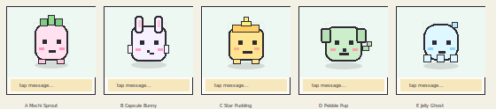

# SVGotchi Character Review

Status: historical Stage 0 concept candidates
Last updated: 2026-06-19 Asia/Seoul

Note: This document is retained as historical concept-review context. The active runtime character is now the exact uploaded PNG character documented in `neutral-base-review.md`.

## Purpose

Stage 0 defines the visual identity before code. These are concept candidates only. No concept is approved until the user selects one. No neutral base SVG, rig implementation, pose sheet, transition preview, model runtime, or source implementation has started.

Preview sheet:

## Shared Constraints For All Concepts

- Fits `viewBox="0 0 100 100"`.
- Keeps the pet in y `0..80`.
- Reserves y `81..100` for the pure-SVG prompt area.
- Uses simple primitive SVG shapes.
- Supports the required face anchors: left eye, right eye, brows, mouth, blush, effects.
- Can keep hidden layers for hearts, tears, zzz, sparkles, question, and anger effects.
- Avoids opaque raster art and complex unriggable path morphing.

## Concept A: Mochi Sprout

Description:

A soft mochi-like round pet with a tiny sprout on top. The body is a simple rounded rectangle/ellipse hybrid, with dot eyes, a small mouth, blush, simple feet, and three leaf blocks.

Rig fit:

- Body maps cleanly to the required `bodyBox`.
- Face anchors are centered and symmetric.
- Sprout can be a stable optional appendage that moves with emotion intensity.
- Effects can originate near the sprout or upper-right sparkle/heart anchors.

Pros:

- Strongest riggability.
- Cute and readable at small sizes.
- Works well for all 30 emotions because the face area is open and symmetric.
- Sprout gives a small identity hook without complicating the rig.
- Good match for low-FPS pixel bounce and shy/love effects.

Cons:

- Less species-specific than bunny or pup.
- Needs color discipline so it does not read too much like a food mascot.

Risk:

- Low. The shape is simple and stable across emotion poses.

## Concept B: Capsule Bunny

Description:

A capsule-shaped bunny-like pet with two block ears, small paws, dot eyes, blush, and a tiny nose/mouth.

Rig fit:

- Body and face fit the required contract.
- Ears can be optional appendage slots with small rotations or offsets.
- Paws can be stable body-attached slots.

Pros:

- Immediately recognizable and cute.
- Ears provide expressive motion for scared, excited, sleepy, and happy states.
- Familiar virtual-pet silhouette.

Cons:

- Ears consume vertical space and may collide with upper effects.
- More appendage movement rules are needed to keep all 30 poses consistent.

Risk:

- Medium-low. Still simple, but ears add a little more rig responsibility.

## Concept C: Star Pudding

Description:

A small pudding-like pet with a cap and a pixel star mark/antenna. Warm yellow palette, rounded body, simple face, blush, and block feet.

Rig fit:

- Body fits the required box.
- Star can be static or an effect-like identity layer.
- Face anchors are clear.

Pros:

- Distinctive silhouette.
- Star motif pairs naturally with sparkle, proud, excited, and grateful states.
- Good visibility on light backgrounds.

Cons:

- Yellow/star theme may make non-happy emotions feel less natural.
- Star shape could blur the boundary between character identity and sparkle effects.

Risk:

- Medium. Needs careful separation between identity star and temporary effect layers.

## Concept D: Pebble Pup

Description:

A small rounded pup-like pet with tiny side ears, nose, mouth, blush, and a block tail.

Rig fit:

- Body and face anchors fit well.
- Side ears can use existing brow/ear-like offsets without dominating the rig.
- Tail can be an optional low-priority appendage.

Pros:

- Friendly and emotionally readable.
- Tail can express excitement, nervousness, and boredom.
- Familiar companion-pet appeal.

Cons:

- Tail and ears add more appendage states.
- Slightly less Tamagotchi-abstract than the mochi concept.

Risk:

- Medium-low. Riggable, but appendage animation scope must stay restrained.

## Concept E: Jelly Ghost

Description:

A soft floating jelly/ghost pet with rounded head, simple face, blush, and blocky lower scallops.

Rig fit:

- Face anchors work cleanly.
- Body can bounce, sway, and squash simply.
- Lower scallops can remain static or change minimally.

Pros:

- Very simple and expressive.
- Floating motion works well for sleepy, scared, sad, and curious states.
- Good shape for low-FPS idle motion.

Cons:

- Ghost theme may skew some emotions toward spooky rather than Tamagotchi-cute.
- Lower scallops are less aligned with the rectangular body contract.

Risk:

- Medium. Visually simple, but body silhouette is less contract-like.

## Recommendation

Recommend Concept A: Mochi Sprout.

Reason:

It has the best balance of cuteness, rig simplicity, emotion readability, and low-FPS animation potential. It uses the fewest special appendage rules while still having a memorable identity marker. It should make Stage 1 neutral base SVG and rig validation easier and lower-risk than the other concepts.

## User Decision Required

Choose one concept before Stage 1 begins:

- A: Mochi Sprout
- B: Capsule Bunny
- C: Star Pudding
- D: Pebble Pup
- E: Jelly Ghost

No Stage 1 neutral base character SVG should begin until the selected concept is explicitly approved.
