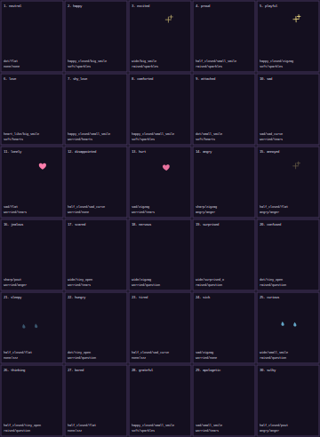

# SVGotchi 30-Emotion Pose Sheet Review

Status: Stage 2 pose sheet for user review
Last updated: 2026-06-17 Asia/Seoul

## Scope

Stage 2 defines target poses for all 30 required emotions using one shared Mochi Sprout rig. This stage does not implement animation, interpolation, prompt input, transition planning, LLM runtime, or packaging.

The current visual direction remains:

- black background
- white-only visible character/UI marks
- primitive SVG pose parameters
- no separate DOM structure per emotion

Pose sheet preview:



## Files

- `src/emotion/emotionCatalog.ts`
- `src/emotion/poseMap.ts`
- `src/emotion/poseSheetPreview.ts`
- `assets/pose-previews/stage-02-30-emotion-pose-sheet.svg`
- `tests/poseMap.test.ts`

## Pose Model

Each emotion maps to one `Pose` parameter set:

- `eyes`
- `mouth`
- `brows`
- `blushOpacity`
- `bodyOffsetY`
- `bodyOffsetX`
- `bodyScale`
- `bodyRotation`
- `effect`
- `effectOpacity`

These parameters are intentionally primitive. They can be interpolated later by the deterministic transition engine without asking the LLM to generate SVG, path data, selectors, or animation code.

## Emotion-To-Pose Mapping

| Emotion | Eyes | Mouth | Brows | Blush | Motion Hint | Effect |
|---|---|---|---|---:|---|---|
| neutral | dot | flat | none | 0 | centered | none |
| happy | happy_closed | big_smile | soft | 0.25 | slight lift | sparkles |
| excited | wide | big_smile | raised | 0.35 | higher lift and small tilt | sparkles |
| proud | half_closed | small_smile | raised | 0.10 | lifted and tilted | sparkles |
| playful | happy_closed | zigzag | soft | 0.20 | side offset and tilt | sparkles |
| love | heart_like | big_smile | soft | 0.80 | lifted | hearts |
| shy_love | happy_closed | small_smile | worried | 1.00 | shy lowered tilt | hearts |
| comforted | happy_closed | small_smile | soft | 0.35 | centered | sparkles |
| attached | dot | small_smile | soft | 0.55 | slight lift | hearts |
| sad | sad | sad_curve | worried | 0 | lowered | tears |
| lonely | sad | flat | worried | 0 | lowered and offset | tears |
| disappointed | half_closed | sad_curve | worried | 0 | lowered | none |
| hurt | sad | zigzag | worried | 0 | lowered and tilted | tears |
| angry | sharp | zigzag | angry | 0 | tense offset and tilt | anger |
| annoyed | half_closed | flat | angry | 0 | slight tense tilt | anger |
| jealous | sharp | pout | worried | 0.20 | side glance tilt | anger |
| scared | wide | tiny_open | worried | 0 | small shrink | tears |
| nervous | wide | zigzag | worried | 0.25 | small offset and tilt | question |
| surprised | wide | surprised_o | raised | 0 | lifted | question |
| confused | dot | tiny_open | raised | 0 | tilted | question |
| sleepy | half_closed | flat | none | 0 | lowered | zzz |
| hungry | dot | tiny_open | worried | 0 | slight lower | question |
| tired | half_closed | sad_curve | none | 0 | low and small | zzz |
| sick | sad | zigzag | worried | 0 | low, small, tilted | none |
| curious | wide | small_smile | raised | 0 | lifted tilt | question |
| thinking | half_closed | tiny_open | raised | 0 | small tilt | question |
| bored | half_closed | flat | none | 0 | lowered | zzz |
| grateful | happy_closed | small_smile | soft | 0.45 | slight lift | sparkles |
| apologetic | sad | small_smile | worried | 0.25 | lowered and tilted | tears |
| sulky | half_closed | pout | angry | 0.10 | side offset and tilt | anger |

## Validation Summary

Verification command:

```powershell
npm run verify
```

Expected Stage 2 checks:

- exactly 30 emotions in the required order
- `POSE_MAP` has exactly one pose for every emotion and no extra keys
- every pose has bounded primitive numeric parameters
- pose sheet preview includes every emotion
- pose sheet preview uses only black and white color literals
- character rig tests continue passing

## User Decision Required

Approve or reject the 30-emotion pose sheet before Stage 3 begins.

No pure SVG prompt prototype work should begin until the 30-emotion pose sheet is explicitly approved.
