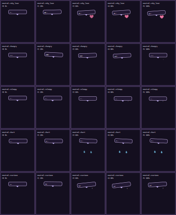

# SVGotchi Deterministic Transition Review

Status: Stage 4 complete, approved with reply-generation exclusion
Last updated: 2026-06-17 03:22:36 Asia/Seoul

## Scope

Stage 4 implements deterministic multi-frame emotion transitions for the approved Mochi Sprout character and the Stage 2 pose map. This stage does not implement Hugging Face model selection, model packaging, local LLM runtime, planner sanitization, full integration, or the final `dist/` artifact.

The visual direction remains:

- black background
- white-only visible character/UI marks
- SVG primitives only
- deterministic frames from typed pose parameters
- no LLM-generated SVG, selectors, path data, or animation code
- no LLM-generated pet reply text or reply style

Transition preview:



## Files

- `src/engine/easing.ts`
- `src/engine/frameScheduler.ts`
- `src/engine/interpolation.ts`
- `src/engine/poseResolver.ts`
- `src/engine/transitionEngine.ts`
- `src/engine/transitionSamples.ts`
- `src/render/effects.ts`
- `src/render/bubble.ts`
- `src/render/renderer.ts`
- `assets/transition-previews/stage-04-sample-transitions.svg`
- `tests/transitionEngine.test.ts`

## Transition Model

The transition engine resolves a `from` emotion and a `to` emotion into primitive `Pose` values, interpolates numeric pose fields across a bounded frame schedule, applies a deterministic easing curve, and adds a named motion overlay. Discrete facial features switch at fixed progress thresholds so the preview remains pixel-like instead of trying to morph arbitrary SVG path data.

The current transition configuration surface is intentionally narrow:

- `from`
- `to`
- `durationMs`
- `fps`
- `easing`
- `motion`
- `effect`
- `blush`

This is the later local planner boundary: a model may eventually choose a sanitized transition plan, but it will not be allowed to write raw SVG, animation code, or pet reply text. The preview speech bubble copy is owned by the app/sample fixture through `previewReply`; it is not part of `TransitionConfig` or future LLM output.

## Required Sample Transitions

| Sample | Duration | FPS | Easing | Motion | Effect | Preview Reply |
|---|---:|---:|---|---|---|---|
| `neutral -> shy_love` | 900ms | 6 | `ease_out` | `tiny_bounce` | `hearts` | `eep...` |
| `neutral -> hungry` | 800ms | 6 | `ease_in` | `sway` | `question` | `snack?` |
| `neutral -> sleepy` | 1000ms | 5 | `linear` | `none` | `zzz` | `zzz...` |
| `neutral -> hurt` | 850ms | 6 | `ease_out` | `shake` | `tears` | `ow...` |
| `neutral -> curious` | 750ms | 6 | `overshoot` | `sway` | `question` | `hmm?` |

The preview SVG samples five frames from each transition: start, 25%, 50%, 75%, and final. The generated preview therefore contains 25 visible transition frame groups.

## Validation Summary

Verification command:

```powershell
npm run verify
```

Result:

- typecheck passed
- 28 total tests passed
- required transition samples generate multiple frames
- transition endpoints include first and final progress states
- preview asset matches renderer output exactly
- preview includes all five required transitions
- preview color literals are limited to `#000` and `#fff`

Additional Stage 4 checks:

- transition preview XML parse: passed
- `data-transition` group count: 25
- unique transitions: `neutral->shy_love`, `neutral->hungry`, `neutral->sleepy`, `neutral->hurt`, `neutral->curious`
- forbidden later-stage directories: no `src/llm`, no `dist`
- no Hugging Face model runtime, Transformers.js runtime, ONNX runtime, or local model planner implementation was started

## User Decision Required

Approve or reject the five sample transition previews before Stage 5 begins.

The user approved these transition previews with one additional contract: LLM output must not generate pet reply text or reply style. Stage 5 model review may proceed, but model packaging and local LLM runtime work still require later approvals.
